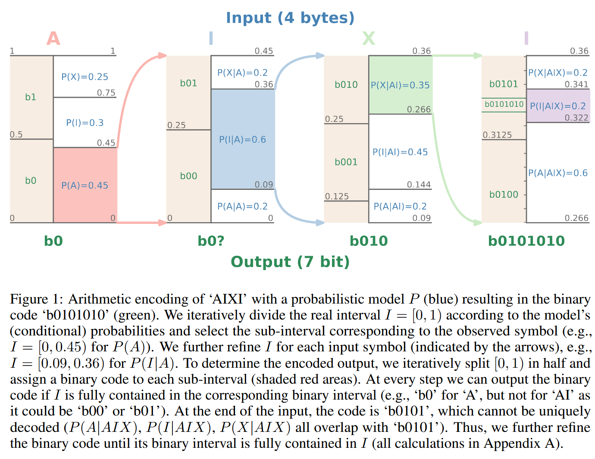
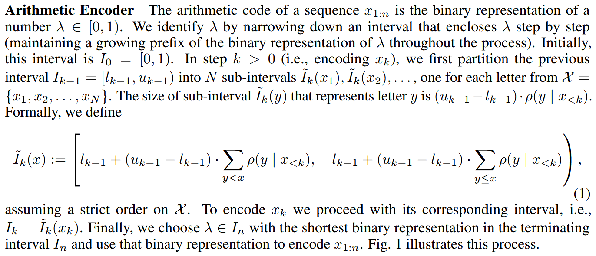
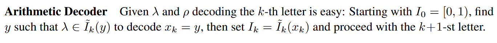
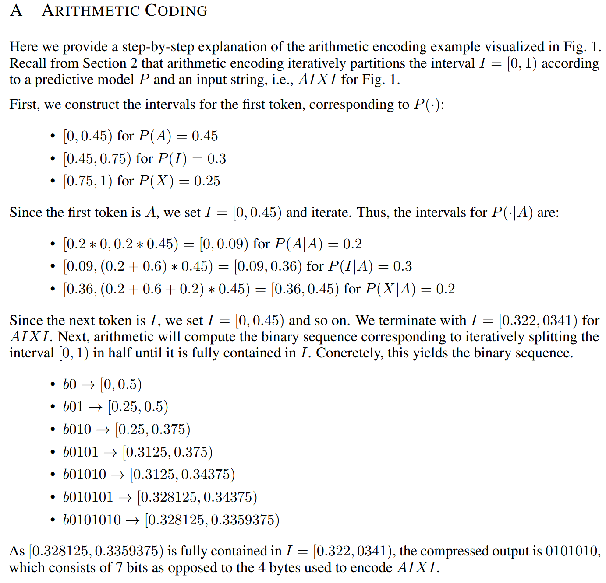
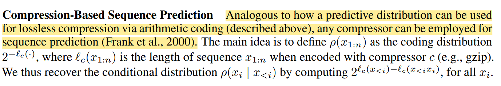

>   最近在开始思考生成与压缩的关系，老师推荐了这篇文章，从压缩的视角看待LLM作为无损压缩器（lossless compressor）[paper](https://arxiv.org/abs/2309.10668)

## Arithmetic Encoding and Decoding

>   假设足够精确，算术编码本质上是用一段2进制码流来表示一个$[0,1)$上的数$\lambda$，从初始区间$[0,1)$开始通过条件概率分布逐步缩小这个区间，在这个最终的区间中选择一个具有最短2进制表示的$\lambda$，并用这个2进制表示作为$x_{1:n}$的编码结果。

>   解码的过程：和编码端具有相同的分布，并根据$\lambda$解码出长度为$k$的序列，从区间$[0,1)$开始，根据该流程分布得到$\lambda$在哪个区间，则解码出对应的字符，区间更新然后继续解码。
---
**图一例子的具体计算见下图：**

## 对数似然和损失函数
>   用参数化的概率分布来进行估计，期望的比特数实际上为交叉熵，而LLM训练的损失函数也是交叉熵。

>   最小化交叉熵即最大化似然函数即最小化数据流的期望长度即最小化训练损失。

>   所以大语言模型的训练目标天然和压缩目标相统一。

## 压缩器用于预测（生成模型）

>   反过来看编码的过程，每编码一个字符就增加一定的比特数，所以实际上根据压缩模型可以得到在已知之前字符的前提下当前字符的条件分布（这个概率也很好计算，即把某个字符添加到当前序列后面看增加了几个比特，就可以根据2的负指数次方得到概率），所以还是一句话：压缩模型本身就是概率模型，根据一个概率模型就可以用于预测。

>   用无损压缩的方式做text的压缩和生成是自然的，但是对于图像，音频这类信息，并不合适，逐步去生成会造成误差累计，导致最终的生成效果很差，实际上并不需要追求每个字节或者token的准确，重建质量和观感是更整体的评价。

一个想法是：token对应codebook，还是用预测的训练方式，但是还要加入失真项。

## **通用编码（Universal Coding）**
**以下为ChatGPT解释**

在上文中，我们讨论的是针对来自某个固定分布 ( $\rho$ ) 的数据的最优（算术）编码。

------

与此相对，对于**所有可计算的采样分布**，理论上可以通过将编码长度 ( $\ell_c(x_{1:n})$ ) 选为序列 ( $x_{1:n}$ ) 的**Kolmogorov复杂度**来实现通用（最优）信源编码（Kolmogorov, 1998；Li & Vitányi, 2019）。

------

在这种选择下，上述定义的条件分布在所有前缀 ( $x_{<i}$ ) 上都是**普适最优的**，从而恢复了 **Solomonoff 预测器**（Solomonoff, 1964a,b；Rathmanner & Hutter, 2011）。

------

Solomonoff 预测器是一个**贝叶斯混合模型**，它对所有可以在某个图灵完备编程语言中实现的预测器进行加权。

------

更具体地，对于一个预测器 ( $q$ )，其程序长度为 ( $\ell_c(q)$ ) 比特，
Solomonoff 预测器为该预测器分配一个先验权重：
$$
[
2^{-\ell_c(q)}
]
$$
------

也就是说，如果 ( $\mathcal{Q}$ ) 是所有可编程且可计算的预测器集合，那么
Solomonoff 预测器为序列 ( $x_{1:n}$ ) 分配的概率为：
$$
[
S(x_{1:n}) = \sum_{q \in \mathcal{Q}} 2^{-\ell_c(q)} , q(x_{1:n})
]
$$
------

因此，对于所有 ( $q \in \mathcal{Q}$ )，都有：
$$
[
S(x_{1:n}) \ge 2^{-\ell_c(q)} , q(x_{1:n})
]
$$
从而得到：
$$
[
-\log_2 S(x_{1:n}) \le -\log_2 q(x_{1:n}) + \ell_c(q)
]
$$
------

注意，( $\ell_c(q)$ ) 是关于预测器 ( $q$ ) 的常数，与序列长度无关。

------

因此：

>   **最优压缩 等价于 最优预测，反之亦然**（Hutter, 2005）。

------

这段话本质在说：

>   **如果你能考虑所有可能的可计算模型，并用程序长度做正则化（Occam），就能得到一个“理论上最优”的预测器与压缩器（Solomonoff）。**

------

这段隐含的是：

### 现代模型 ≈ Solomonoff 的近似

| 理论           | 现实              |
| -------------- | ----------------- |
| 所有程序       | 神经网络族        |
| 程序长度 prior | 模型复杂度 / 正则 |
| 贝叶斯混合     | 训练 + 参数学习   |

------

>   **Transformer 本质是在近似一个“受限的 Solomonoff 预测器”**

## model-datasize tradeoff
在**考虑模型大小**之后，压缩性能在随着数据集增大的过程中呈现先减小后增大的变化规律。实际上为scaling law提供了一个新视角，测试数据集越大，要达到更好的压缩性能需要更大的模型。

## in-context learning
作者的观点认为：语言模型相比传统压缩方法拥有更多的参数，对上下文有更好的理解，因而能在很短的序列下快速adapt，而传统方法则依靠序列中的dependence。二者都在序列长度增加时有更好的压缩性能。
我的理解是：语言模型能够比传统方法有更好的性能，可能是因为它确实学习到了一些其他的信息能够更好的建立概率模型，这些信息是传统方法不知道的。

## tokenization is compression
分词实际上是一种无损压缩，这一步已经处理了一些冗余以及结构信息。

增加字母表大小可以缩短序列长度使其包含更多信息，但由于字母表变大也让预测任务变得困难，降低条件分布的熵也更困难。

所以增加字母表大小会减小序列长度增加预测任务难度，反之则会增加序列长度减小预测任务难度，理论上来说，对于这一种无损压缩两者应该会相互抵消，但实际情况并不是，对于小模型增加字母表大小对压缩有帮助，而对于大模型反而降低压缩性能。

可能的解释：对于大模型来说，自身就可以学习到足够的信息进行压缩，字母表的大小可能会成为约束。
